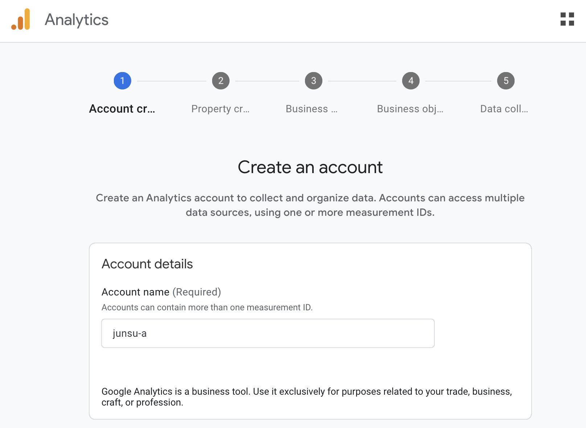
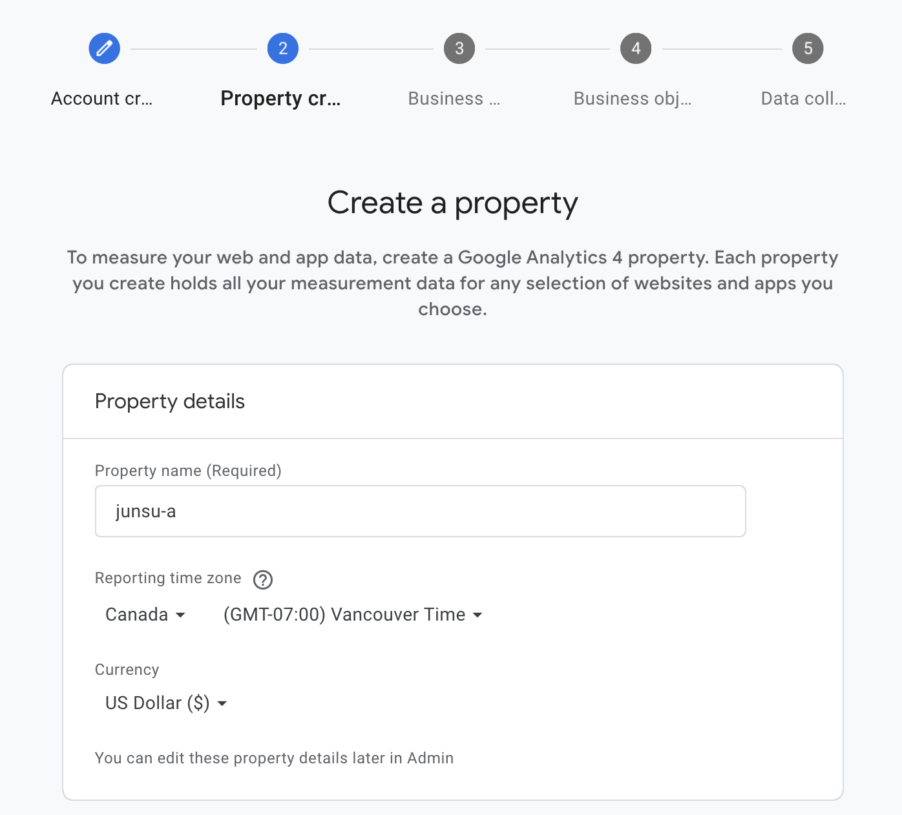
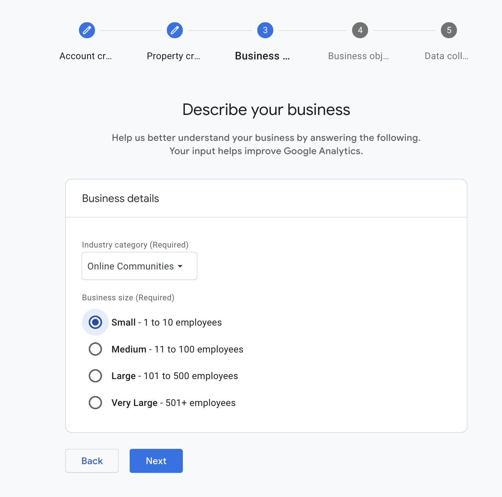
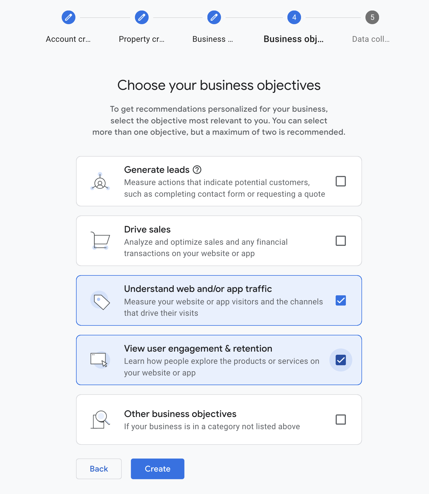
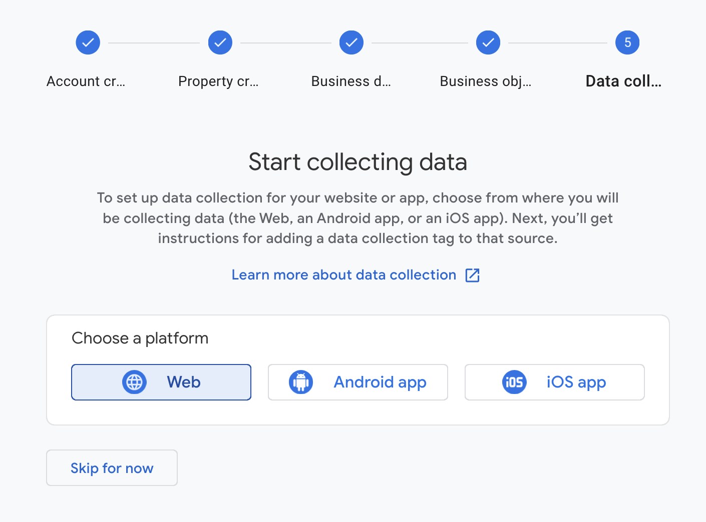
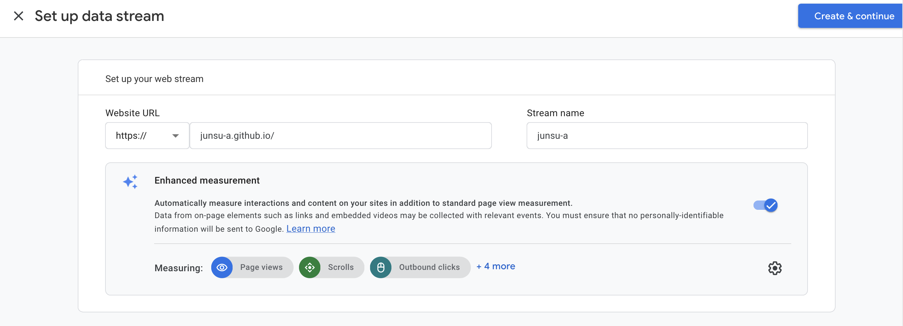
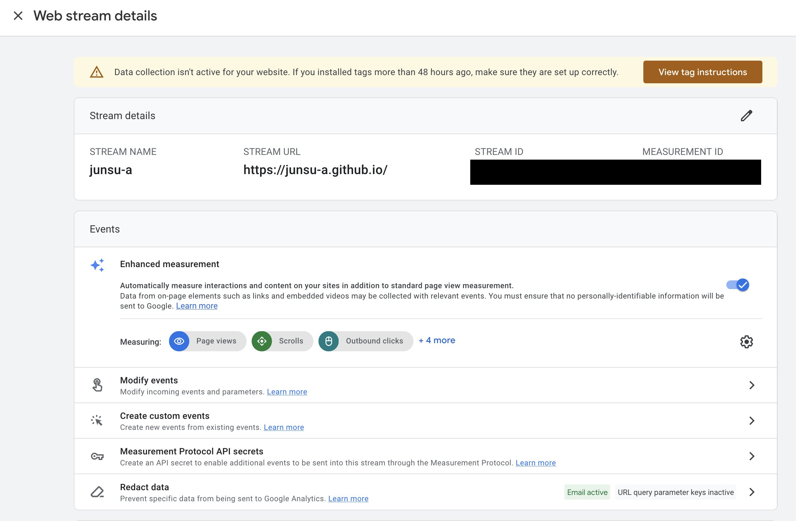
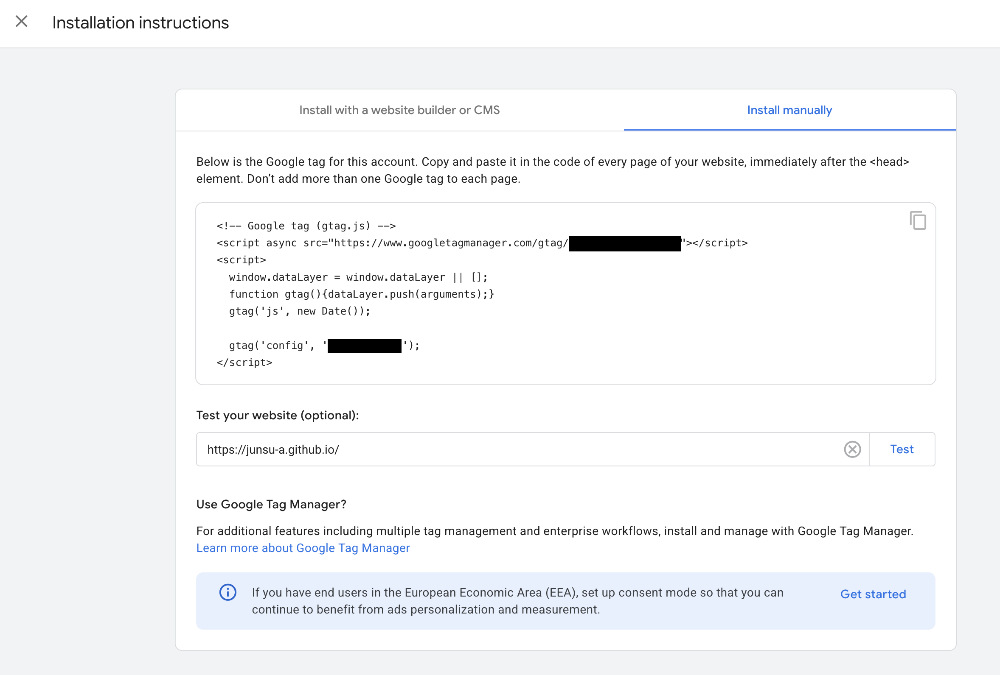
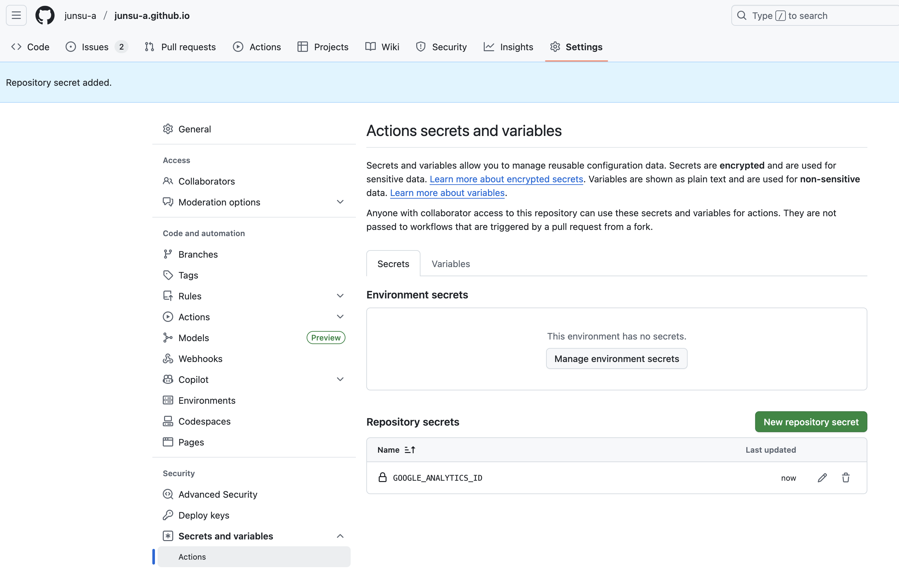

# 배경

지금 이 블로그는 Astro 기반으로 구현되어 GitHub Pages로 호스팅 중입니다. 따라서 방문자 분석 도구가 기본적으로 탑재되어 있지 않습니다.

물론 많은 방문자와 인기를 원하고 블로그 글을 적는다기보다는 제가 배워가는 과정을 기록하고 싶은 마음이 크지만, 아래와 같은 이유 때문에 방문자들을 이해하는 것이 중요하다는 생각이 들었습니다.

1. **독자층의 명확한 이해:** 이 글을 읽는 방문자분이 서울에 사는 대학생인지, 판교에 있는 30대 남성 개발자인지, **주로 모바일로 접속하는지 PC로 접속하는지** 등을 파악하는 것입니다. 제 독자가 누구인지 명확히 알게 되면, 더욱 효과적으로 독자의 눈높이에 맞는 주제와 글쓰기 스타일을 선택하는 것이 가능할 것이라 생각했습니다.

2. **실패 지점 분석:** **유독 한 페이지에서만 방문자들이 이탈한다면**, 특정 글의 제목이나 내용이 부족하거나 가독성이 떨어진다는 신호일 수 있습니다. 이처럼 데이터를 통해 제 **글의 전달 방식에 문제는 없는지** 발견하고 개선할 수 있을 거라 생각합니다.

# 어떤 분석 도구를 선택할까?

방문자 분석의 필요성을 느꼈으니, 이제는 '어떤 도구를 사용할지' 선택할 차례입니다. 수많은 분석 도구가 있지만, 저와 같은 개인 블로그 운영자에게는 두 가지 선택지가 가장 눈에 띄었습니다. 바로 오랫동안 데이터 분석의 표준으로 증명된 **구글 애널리틱스(Google Analytics)**와, 비교적 최근에 등장하여 가파르게 성장하고 있는 **마이크로소프트 클래리티(Microsoft Clarity)**입니다.

이 두 도구 모두 무료 요금제가 있지만, 저는 일단 구글 애널리틱스를 선택하기로 했습니다.
이유는 단순히 구글 애널리틱스가 구글 광고(Google Ads)와 연동이 쉽기 때문입니다.
당장 광고를 달 계획은 없지만, 언제 직장을 잃거나 쉬고 싶을지 미래는 알 수 없기에 수익화와 관련된 경험을 조금이나마 쌓고 싶었거든요. 너무 속물 같나요? 하지만 저는 "better safe than sorry"라고 믿거든요.

# 도입 과정

## Google Analytics 계정 생성

# 블로그와 Google Analytics 연동하기

