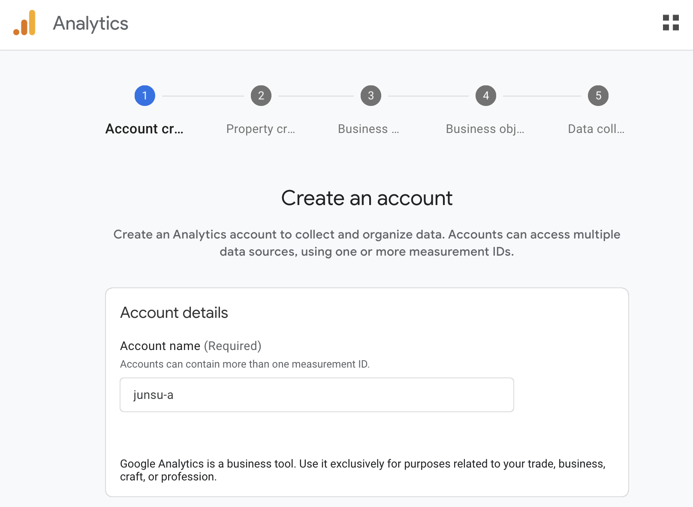
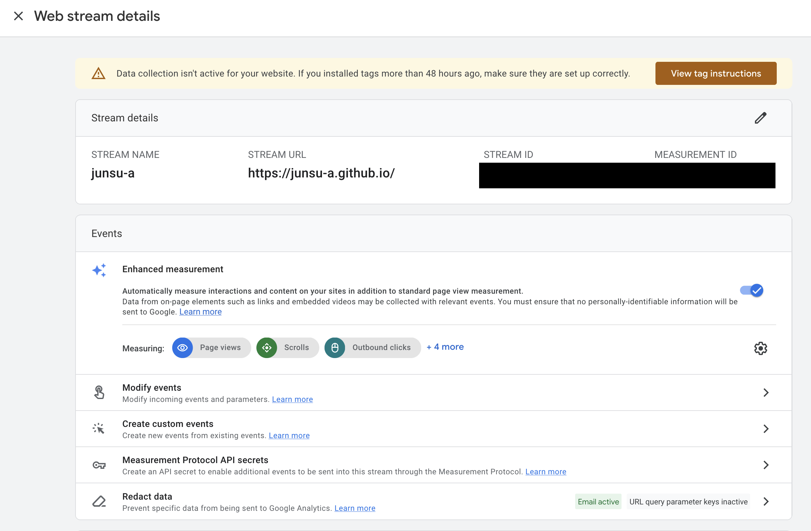

# Background

This blog is built with Astro and hosted on GitHub Pages. Consequently, it doesn't come with a built-in visitor analytics tool.

Of course, my primary goal isn't to attract a large audience or gain popularity, but rather to document my learning process. However, I've come to realize that understanding my visitors is important for the following reasons:

1.  **Clearly Understanding My Audience:** It's about figuring out who is reading my posts. Are they university students in Seoul, or male developers in their 30s in Pangyo? Do they primarily use mobile or PC? If I have a clear understanding of my audience, I thought it would be possible to more effectively choose topics and writing styles that match their level.

2.  **Analyzing Failure Points:** If visitors consistently leave from one particular page, it could be a sign that the title or content of that specific post is lacking, or that its readability is poor. I believe that through data, I can discover and improve upon any issues in my delivery method.

# Which Analytics Tool to Choose?

Now that I've recognized the need for visitor analytics, it's time to choose a tool. While there are countless analytics tools available, two options stood out for a personal blog operator like myself: **Google Analytics**, which has long been the proven standard in data analysis, and **Microsoft Clarity**, a relatively new but rapidly growing contender.

Both tools offer a free plan, but I decided to go with Google Analytics for now.
The reason is simple: Google Analytics integrates easily with Google Ads.
I don't have immediate plans to run ads, but I never know what the future holds—I might lose my job or want to take a break. So, I wanted to build even a little bit of experience with monetization. Does that sound too materialistic? Maybe, but I believe it's "better safe than sorry."

# Implementation Process

## Creating a Google Analytics Account

1.  Set an account name.
    

2.  Set up the property. I just entered my blog's name and set the time zone to Vancouver.
    

3.  I wasn't sure which category to choose... so I went with "Online Communities" as it seemed the most fitting.
    

4.  This part didn't seem very important, so I picked the most intuitive option.
    

5.  Since it's a web-based blog, I chose "Web" as the platform.
    

6.  I complete the data stream creation with my blog URL and a simple stream name.
    

# Integrating Google Analytics with the Blog


Afterward, you can find the Measurement ID in the data stream you just created.


And in the tag instructions at the top right, you can see which script to add, and there's also a feature to test the script after adding it.

## Step 1: Centralizing Configuration

You could just copy the tracking code provided by Google Analytics and paste it directly into your HTML file. However, if configuration values like the tracking ID are scattered throughout your code, managing them later can become very cumbersome. Therefore, it's best to manage configuration details in a single file.
First, since I'm using TypeScript, I'll add `googleAnalyticsId` to the `SiteConfig` type. This allows me to benefit from code autocompletion and type checking.

```ts title="src/types/config.ts"
// ... existing codes ...
    toc: {
        enable: boolean;
        depth: 1 | 2 | 3;
    };

    googleAnalyticsId?: string; // added this line

    favicon: Favicon[];
};

export type Favicon = {
// ... existing codes ...
```

Next, I'll add the actual tracking ID to the src/config.ts file. This way, if I ever need to change the ID, I only have to modify this one file.

```ts title="src/config.ts"
// ... existing codes ...
    toc: {
        enable: true,
        depth: 2,
    },
    googleAnalyticsID: import.meta.env.GOOGLE_ANALYTICS_ID, // My Google Analytics measurement ID
    favicon: [
        // ... existing codes ...
```
While the Google Analytics ID isn't highly sensitive information, as someone with a DevOps mindset, I felt a sense of guilt about managing secrets in one place and exposing anything externally. So, I decided to store my ID in GitHub Actions Secrets and fetch it during the GitHub Actions deployment pipeline.

First, I'll add a new secret named `GOOGLE_ANALYTICS_ID` in the GitHub repository's Settings > Secrets and variables > Actions menu.

Then, I'll modify the `src/config.ts` file to read the ID from an environment variable instead of directly from the code.
After that, I'll update the GitHub Actions workflow file (.github/workflows/deploy.yaml) to inject the secret as an environment variable at build time.


Then, I'll modify the `src/config.ts` file to read the ID from an environment variable instead of directly from the code.
After that, I'll update the GitHub Actions workflow file (`.github/workflows/deploy.yaml`) to inject the secret as an environment variable at build time.

``` yaml title="deploy.yaml"
// ... existing codes ...
      - name: Install, build, and upload your site
        uses: withastro/action@v3
        with:
          node-version: 23
        env: # Added this part
          GOOGLE_ANALYTICS_ID: ${{ secrets.GOOGLE_ANALYTICS_ID }}

  deploy:
    needs: build
// ... existing codes ...
```

## Step 2: Injecting the Tracking Script into All Pages

The tracking script must be included on every page of the website. In an Astro project, the best way to do this is to add the script to the layout file that serves as the base template for all pages. In our Astro blog project, `src/layouts/Layout.astro` serves this purpose.
I added the following code inside the `<head>` tag.

``` ts title="Layout.astro"
// ... existing codes ...
		<meta name="viewport" content="width=device-width" />
		<meta name="generator" content={Astro.generator} />
		{
			import.meta.env.PROD && siteConfig.googleAnalyticsID && (
				<>
					<script
						async
						src={`https://www.googletagmanager.com/gtag/js?id=${siteConfig.googleAnalyticsID}`}
					/>
					<script define:vars={{ id: siteConfig.googleAnalyticsID }}>
						window.dataLayer = window.dataLayer || [];
						function gtag() {
							dataLayer.push(arguments);
						}
						gtag("js", new Date());

						gtag("config", id);
					</script>
				</>
			)
		}
		{favicons.map(favicon => (
			<link rel="icon"
// ... existing codes ...
```

Let's break down a few important parts here:
- `import.meta.env.PROD`: This is an environment variable provided by Astro at build time. It's true when generating production files with astro build and false when running the development server with astro dev. By adding this condition, we prevent the analytics script from running during development, thus avoiding the collection of unnecessary data.
- `siteConfig.googleAnalyticsID`: I've added a condition to inject the script only if googleAnalyticsID exists in the configuration file. If I ever want to temporarily disable analytics, I can just remove that line from the `config.ts` file.
- `define:vars`: This Astro feature allows us to securely pass build-time environment variables (like `siteConfig.googleAnalyticsID`) to a client-side `<script>` tag.

Now, when I push the code to the main branch, GitHub Actions will automatically run the build, using the tracking ID stored in the secrets.

## Step 3: Testing

Because testing is always important.

After the deployment was complete, I ran the test provided by Google Analytics and confirmed that it was successful.

# Conclusion

This concludes the entire process of adding Google Analytics to an Astro-based blog. We've covered everything from contemplating why an analytics tool is necessary to the technical details of writing and deploying the actual code using GitHub Actions secrets.

In particular, we focused on going beyond simply copying the tracking code and instead on how to manage the tracking ID safely and efficiently using a configuration file and injecting it as an environment variable. I personally liked thinking through the small details, like preventing data collection during development.

## Next Step: Introducing My Blog to Search Engines

I've learned that just installing an analytics tool doesn't mean my blog will automatically appear prominently in Google or Naver search results. A process of 'registering' and notifying search engines is needed so they can better understand the existence and structure of my blog.

Typically, the following two tools are used for this purpose:
- Google Search Console
- Naver Search Advisor

Registering my blog with these tools and submitting a sitemap is also a crucial step, so I plan to get started on that as soon as possible.
