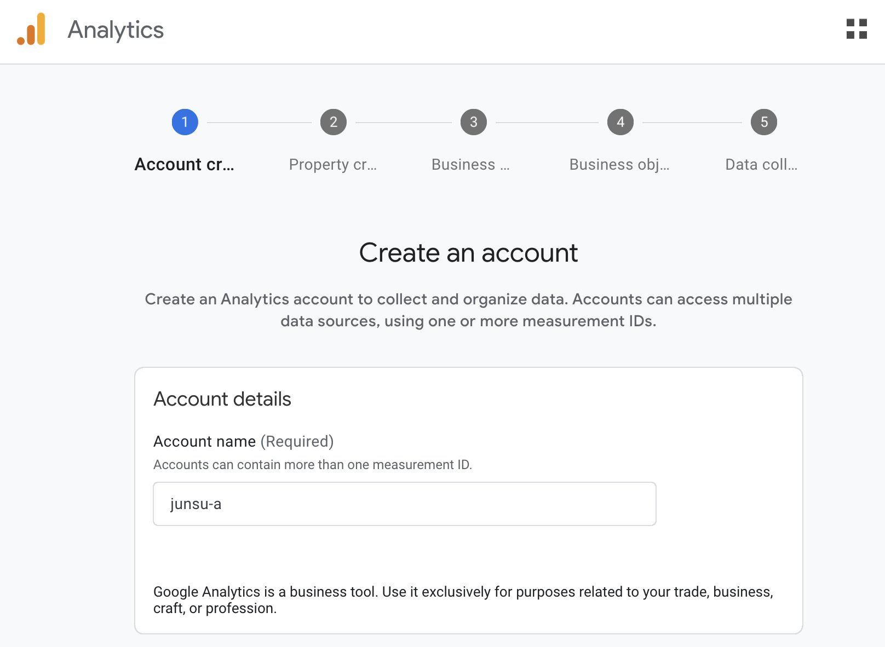
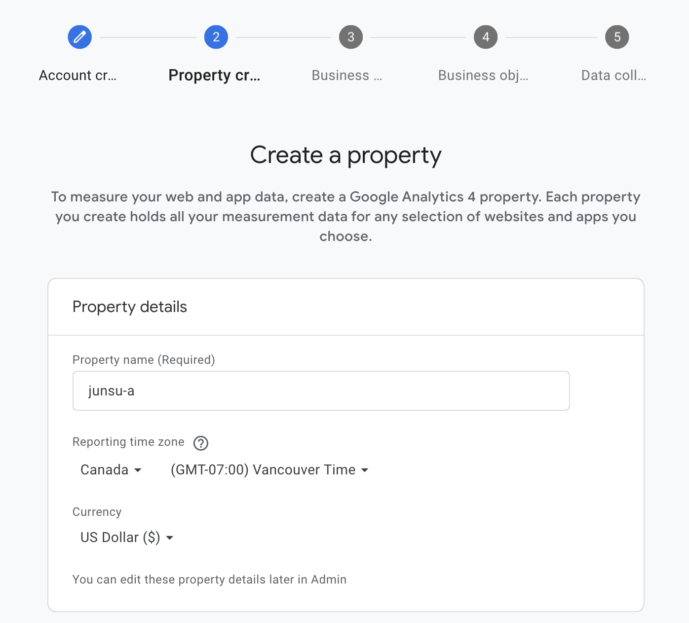
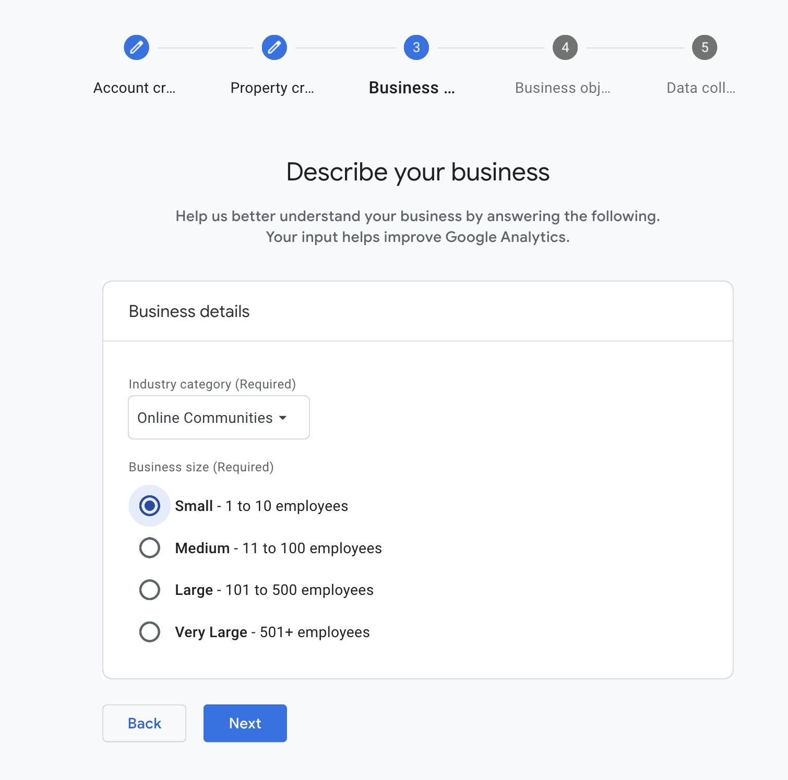
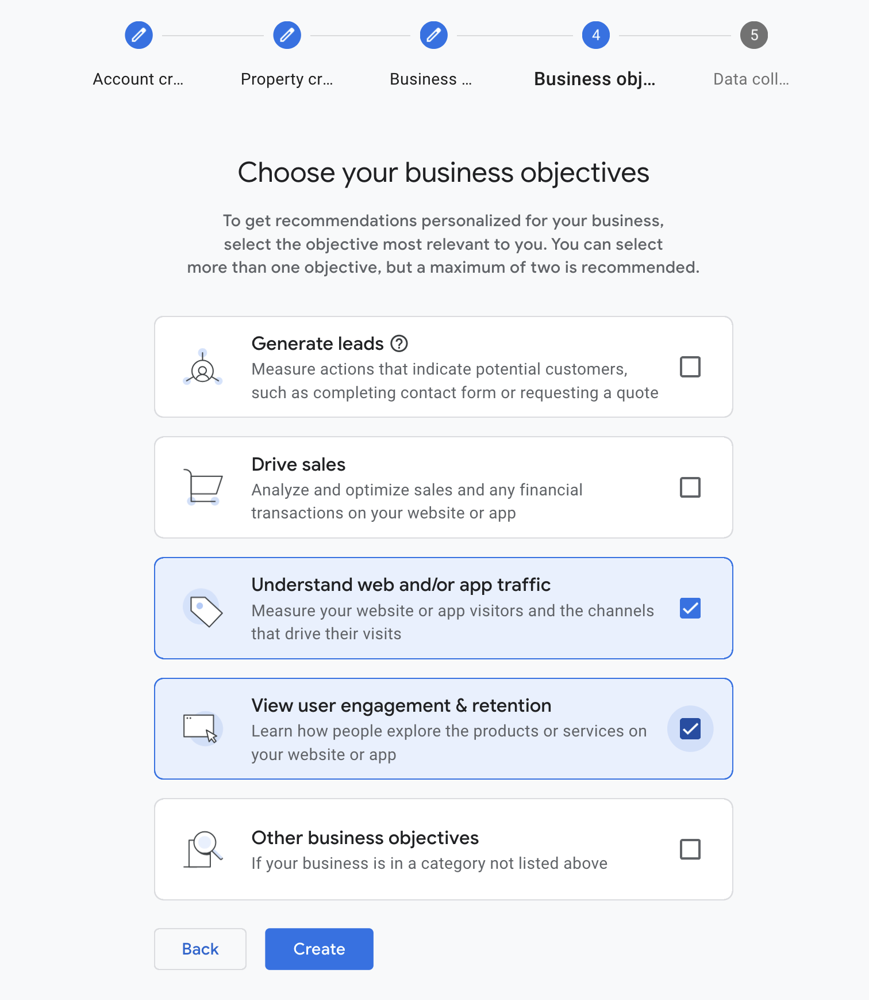
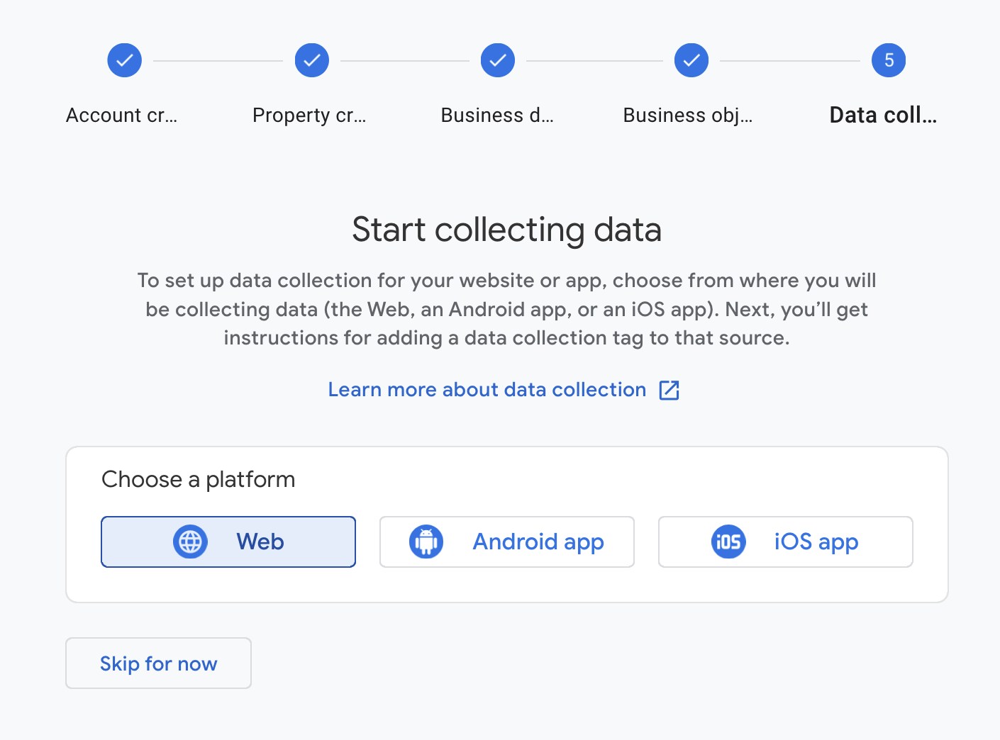
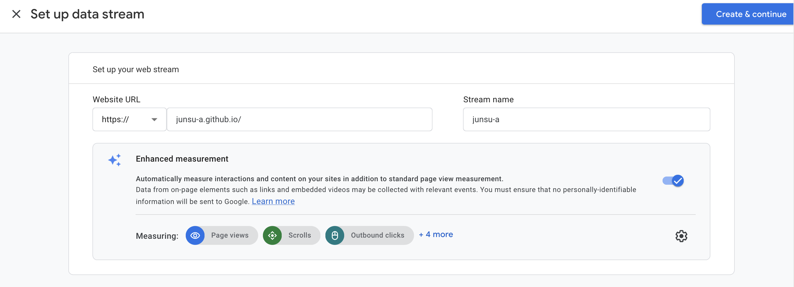
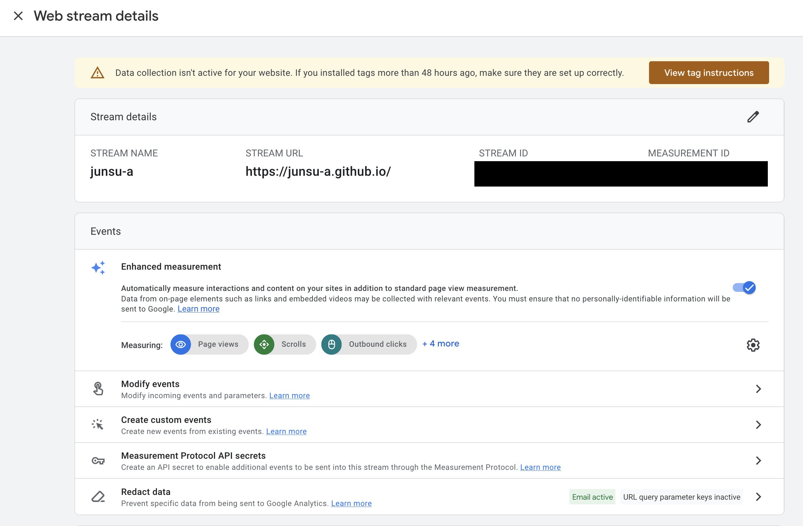
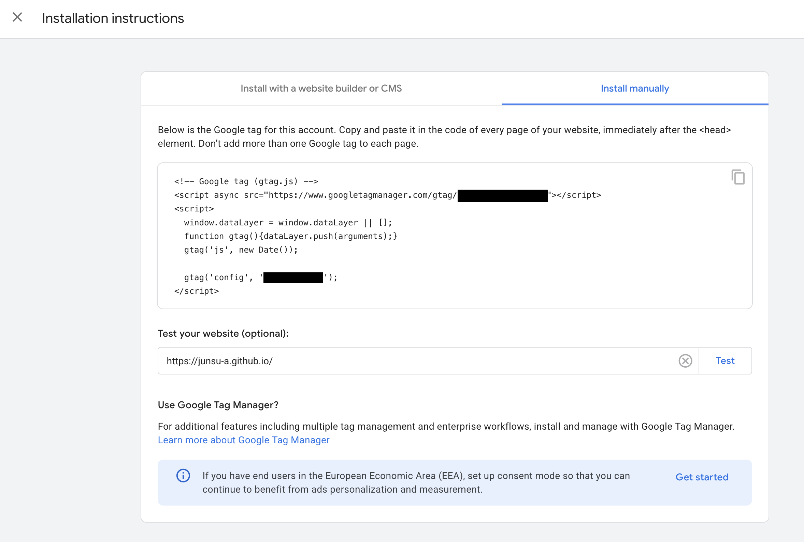
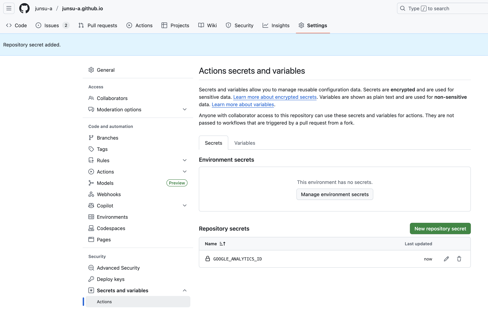
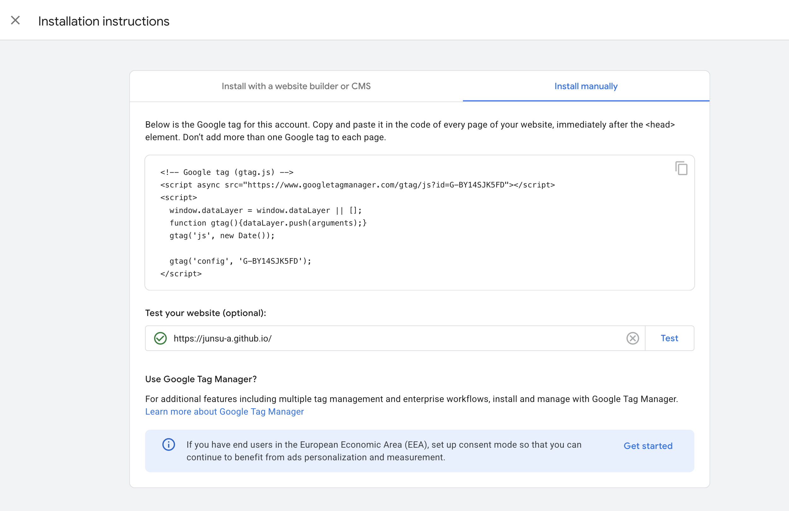

# 배경

지금 이 블로그는 Astro 기반으로 구현되어 GitHub Pages로 호스팅 중입니다. 따라서 방문자 분석 도구가 기본적으로 탑재되어 있지 않습니다.

물론 많은 방문자와 인기를 원하고 블로그 글을 적는다기보다는 제가 배워가는 과정을 기록하고 싶은 마음이 크지만, 아래와 같은 이유 때문에 방문자들을 이해하는 것이 중요하다는 생각이 들었습니다.

1. **독자층의 명확한 이해:** 이 글을 읽는 방문자분이 서울에 사는 대학생인지, 판교에 있는 30대 남성 개발자인지, **주로 모바일로 접속하는지 PC로 접속하는지** 등을 파악하는 것입니다. 제 독자가 누구인지 명확히 알게 되면, 더욱 효과적으로 독자의 눈높이에 맞는 주제와 글쓰기 스타일을 선택하는 것이 가능할 것이라 생각했습니다.

2. **실패 지점 분석:** **유독 한 페이지에서만 방문자들이 이탈한다면**, 특정 글의 제목이나 내용이 부족하거나 가독성이 떨어진다는 신호일 수 있습니다. 이처럼 데이터를 통해 제 **글의 전달 방식에 문제는 없는지** 발견하고 개선할 수 있을 거라 생각합니다.

# 어떤 분석 도구를 선택할까?

방문자 분석의 필요성을 느꼈으니, 이제는 '어떤 도구를 사용할지' 선택할 차례입니다. 수많은 분석 도구가 있지만, 저와 같은 개인 블로그 운영자에게는 두 가지 선택지가 가장 눈에 띄었습니다. 바로 오랫동안 데이터 분석의 표준으로 증명된 **구글 애널리틱스(Google Analytics)** 와, 비교적 최근에 등장하여 가파르게 성장하고 있는 **마이크로소프트 클래리티(Microsoft Clarity)** 입니다.

이 두 도구 모두 무료 요금제가 있지만, 저는 일단 구글 애널리틱스를 선택하기로 했습니다.
이유는 단순히 구글 애널리틱스가 구글 광고(Google Ads)와 연동이 쉽기 때문입니다.
당장 광고를 달 계획은 없지만, 언제 직장을 잃거나 쉬고 싶을지 미래는 알 수 없기에 수익화와 관련된 경험을 조금이나마 쌓고 싶었거든요. 너무 속물 같나요? 하지만 저는 "better safe than sorry"라고 믿거든요.

# 도입 과정

## Google Analytics 계정 생성

1. 어카운트 이름 설정


2. 속성 설정. 단순히 제 블로그 이름을 적고 밴쿠버 시간대로 설정했습니다.


3. 어떤 카테고리로 정해야 할지 고민이 되더라구요... 그래서 제일 만만해보이는 온라인 커뮤니티로 설정


4. 이 부분은 정말 중요하지 않아 보여서 제일 직관적인걸로 골라주고


5. 웹버전 블로그이니 플랫폼은 웹으로


6. 제 블로그 url과 단순히 블로그 이름으로 데이터 스트림 생성을 완료합니다


# 블로그와 Google Analytics 연동하기


그 후 방금 생성한 데이터 스트림에서 ID 확인이 가능합니다.


그리고 오른쪽 위에 있는 태그 설명에서 어떤 스크립트를 추가해야하는지 확인이 가능하고, 스크립트 추가 후 테스트 기능도 있습니다.

## 1단계: 설정 정보를 한곳으로 모으기

구글 애널리틱스에서 제공하는 추적 코드를 그대로 복사해서 HTML 파일에 붙여넣을 수도 있습니다. 하지만 추적 ID 같은 설정값들이 코드 곳곳에 흩어져 있으면 나중에 관리하기가 매우 번거롭습니다. 따라서 설정 정보는 한 파일에서 관리하는 것이 좋습니다.
먼저, 타입스크립트를 사용하고 있으므로 `SiteConfig` 타입에 googleAnalyticsID를 추가해줍니다. 이렇게 하면 코드 자동완성이나 타입 체크의 이점을 누릴 수 있습니다.

```ts title="src/types/config.ts"
// ... existing codes ...
	toc: {
		enable: boolean;
		depth: 1 | 2 | 3;
	};

	googleAnalyticsId?: string; // added this line

	favicon: Favicon[];
};

export type Favicon = {
// ... existing codes ...
```

그 다음, 실제 추적 ID를 src/config.ts 파일에 추가합니다. 이렇게 하면 나중에 ID를 변경해야 할 때 이 파일만 수정하면 됩니다.

```ts title="src/config.ts"
// ... existing codes ...
	toc: {
		enable: true, 
		depth: 2,
	},
	googleAnalyticsID: import.meta.env.GOOGLE_ANALYTICS_ID, // My Google Analytics measurement ID
	favicon: [
		// ... existing codes ...
```
구글 애널리틱스 ID가 민감한 정보는 아니지만, 데브옵스로써 한 곳에서 시크릿를 관리하고 뭐든지 외부에 노출시키는것에 죄책감이 들었기에에, GitHub Actions Secret에 제 아이디를 저장하고 깃헙 액션 배포 파이프라인에서 가져오기로 결정했습니다.

먼저, GitHub 레포지토리의 Settings > Secrets and variables > Actions 메뉴에서 GOOGLE_ANALYTICS_ID라는 이름으로 시크릿을 추가합니다.



그런 다음, src/config.ts 파일을 수정하여 코드에서 직접 ID를 읽는 대신 환경 변수에서 읽어오도록 변경합니다.
그 후 GitHub Actions 워크플로우 파일(`.github/workflows/deploy.yaml`)을 아래와 같이 수정하여 빌드 시점에 시크릿을 환경 변수로 주입하도록 설정합니다.

``` yaml title="deploy.yaml"
// ... existing codes ...
      - name: Install, build, and upload your site
        uses: withastro/action@v3
        with:
          node-version: 23
        env: # Added this part
          GOOGLE_ANALYTICS_ID: ${{ secrets.GOOGLE_ANALYTICS_ID }}

  deploy:
    needs: build
// ... existing codes ...
```

## 2단계: 모든 페이지에 추적 스크립트 삽입하기
추적 스크립트는 웹사이트의 모든 페이지에 포함되어야 합니다. Astro 프로젝트에서는 모든 페이지의 기본 틀이 되는 레이아웃 파일에 스크립트를 추가하는 것이 가장 좋은 방법입니다. 우리 아스트로 블로그 프로젝트에서는 `src/layouts/Layout.astro` 파일이 그 역할을 합니다.
`<head>` 태그 안에 아래 코드를 추가했습니다.

``` ts title="Layout.astro"
// ... existing codes ...
		<meta name="viewport" content="width=device-width" />
		<meta name="generator" content={Astro.generator} />
		{
			import.meta.env.PROD && siteConfig.googleAnalyticsID && (
				<>
					<script
						async
						src={`https://www.googletagmanager.com/gtag/js?id=${siteConfig.googleAnalyticsID}`}
					/>
					<script define:vars={{ id: siteConfig.googleAnalyticsID }}>
						window.dataLayer = window.dataLayer || [];
						function gtag() {
							dataLayer.push(arguments);
						}
						gtag("js", new Date());

						gtag("config", id);
					</script>
				</>
			)
		}
		{favicons.map(favicon => (
			<link rel="icon"
// ... existing codes ...
```

여기서 몇 가지 중요한 부분을 짚어보겠습니다.
- `import.meta.env.PROD`: Astro가 빌드 시 제공하는 환경 변수입니다. `astro build` 명령으로 실제 서비스용 파일을 생성할 때는 true가 되고, astro dev로 개발 서버를 실행할 때는 false가 됩니다. 이 조건을 추가함으로써 개발 중에는 애널리틱스 스크립트가 실행되지 않도록 하여 불필요한 데이터가 수집되는 것을 막을 수 있습니다.
- `siteConfig.googleAnalyticsID`: 설정 파일에 googleAnalyticsID가 있을 때만 스크립트를 삽입하도록 조건을 걸었습니다. 만약 애널리틱스 사용을 잠시 중단하고 싶다면 `config.ts` 파일에서 해당 라인을 지우기만 하면 됩니다.
- `define:vars`: Astro의 기능으로, 빌드 환경 변수(`siteConfig.googleAnalyticsID`)를 클라이언트 사이드 `<script>` 태그로 안전하게 전달할 수 있게 해줍니다.

이제 코드를 main 브랜치에 푸시하면 GitHub Actions가 자동으로 빌드를 진행하면서 시크릿에 저장된 추적 ID를 사용하게 됩니다. 

## 3단계: 테스트

테스트는 언제나 중요하니까요.

배포가 끝난 후, Google Analytics에서 제공하는 테스트를 실행해보니 성공하는 것을 확인 할 수 있었습니다.


# 마무리

이것으로 Astro 기반의 블로그에 구글 애널리틱스를 도입하는 모든 과정이 끝났습니다. 왜 분석 도구가 필요한지 고민하는 것부터 시작해, 실제 코드를 작성하고 GitHub Actions의 시크릿을 이용해 배포하는 기술적인 부분까지 자세히 적어보았습니다..

특히 단순히 추적 코드를 복사하는 것을 넘어, 설정 파일을 이용하고 환경 변수를 주입하는 방식으로 추적 ID를 안전하고 효율적으로 관리하는 방법에 집중했습니다. 개발 중에는 데이터가 수집되지 않도록 막는 작은 디테일까지 생각한 부분이 개인적으로 좋았습니다..

## 다음 단계: 검색 엔진에 내 블로그 알리기

분석 도구를 설치했다고 해서 바로 구글이나 네이버 검색 결과에 블로그가 잘 노출되는 것은 아니더라구요. 검색 엔진이 제 블로그의 존재와 구조를 더 잘 이해하도록 '등록'하고 알려주는 과정이 필요해 보였습니다.

이를 위해 보통 다음 두 가지 도구를 사용하게 됩니다.
- 구글 서치 콘솔 (Google Search Console)
- 네이버 서치어드바이저 (Naver Search Advisor)

이 도구들에 블로그를 등록하고 사이트맵(sitemap)을 제출하는 과정 역시 중요한 단계이므로, 최대한 빨리 시작해보겠습니다.
